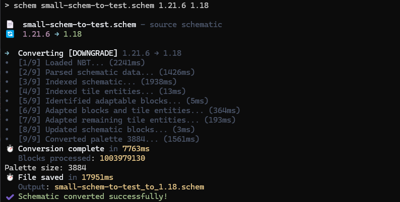
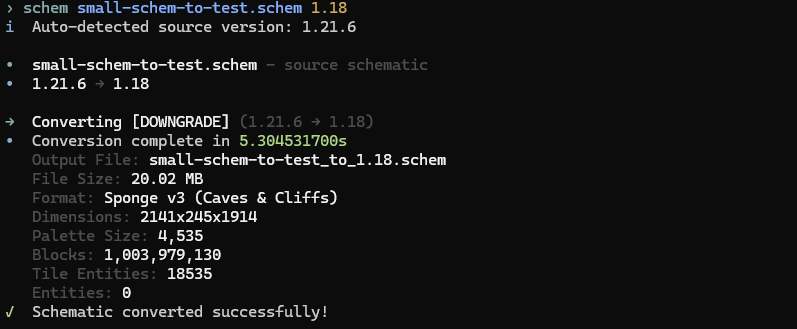

<div align="center">
  
  <h1 align="center" style="margin-top: 10px;">Totem</h1>
</div>

<p align="center">
  
  
  
</p>

Totem is a high-performance, zero-allocation Named Binary Tag (NBT) library for Kotlin/JVM. It leverages Project Panama's native capabilities and a native Rust companion library (`totem-sys`) to achieve maximum throughput with minimal garbage collection pressure. Requires JDK 24 or higher.

## Key Features

* **Off-Heap Execution**: Traverse and query huge NBT data trees without generating GC pressure.
* **High-Volume Translations**: Accelerated native VarInt decoders specifically designed for massive block manipulations.
* **Direct Anvil Operations**: Fast, memory-mapped read and write operations on Minecraft region files (`.mca`).
* **Kotlin DSL**: An expressive, tree-based builder API for constructing clean NBT trees.

## Technical Architecture

Totem is engineered to minimize memory copying, JVM heap garbage collection, and FFI transition overheads when dealing with the [Minecraft NBT format](https://minecraft.wiki/w/NBT_format) and [Anvil Region files](https://minecraft.wiki/w/Anvil_file_format).

### Off-Heap Layouts & Panama FFM
Instead of parsing the binary payload into intermediate Java objects, Totem maps NBT structures directly onto raw memory segments using Java's [Foreign Function & Memory (FFM) API (JEP 454)](https://openjdk.org/jeps/454).

> [!NOTE]
> **Flyweight Pattern**: Off-heap tags are modeled as Kotlin [inline value classes](https://kotlinlang.org/docs/inline-classes.html) (`@JvmInline value class`) wrapping a single `MemorySegment`. At runtime, the wrapper is completely erased by the compiler, leaving only the 64-bit reference to the off-heap segment.
> 
> **Zero-Copy Slicing**: Nested structures are accessed by slicing (`segment.asSlice(...)`) rather than copying data onto the JVM heap.

### Rust-FFI VarInt Decoders
Minecraft block data relies heavily on [VarInt and VarLong encoding](https://minecraft.wiki/w/Java_Edition_protocol/Packets#VarInt_and_VarLong). Rather than decoding them on the JVM:
* **[SWAR (SIMD Within A Register)](https://en.wikipedia.org/wiki/SWAR) Parallelization**: The native `totem-sys` Rust library uses bitwise operations to decode up to four 1-byte VarInts in parallel inside a single register load.
* **Batched Crossings**: JVM-to-Native transitions are minimized by passing raw pointers and lengths to Rust, processing millions of elements in a single native downcall.

> [!TIP]
> **16-Bit Optimization (RAM Savings)**: Because a schematic block palette mathematically cannot exceed 65,536 unique states (fitting within an unsigned short), Totem decodes VarInt data directly into 16-bit `Short` arrays instead of standard 32-bit `Int` arrays. This is a deliberate design trade-off that halves the memory footprint (saving 50% RAM), prioritizing speed and memory efficiency. If full 32-bit VarInt range is needed for other structures in the future, a dedicated method can be added.

## Performance Benchmark

In an end-to-end NBT pipeline test (loading a compressed schematic of 44 million blocks (`18578.schem`), parsing it, modifying block IDs in a volume, and serializing/saving back to a GZIP file):

| Library | Avg Time / Operation | Performance |
| :--- | :--- | :--- |
| **Querz NBT** (Standard Java NBT) | 1,216.59 ms | Baseline |
| **Totem (FFM + Rust)** | **216.40 ms** | **5.62x Faster** |

*Measured on JDK 24 (HotSpot 64-Bit Server VM).*

### Real-World Schematic Conversion Impact (1 Billion Blocks)

The screenshots below show the CLI execution times when downgrading a massive schematic containing **1,003,979,130 blocks** from version 1.21.6 to 1.18:

* **Without Totem** (Standard Heap NBT): Loading and conversion took `7.76s`, and saving the file took `17.95s` (Total: **~25.71 seconds**).
* **With Totem** (Panama FFM + Rust): The entire load, conversion, and save pipeline completed in **`5.30 seconds`** (a **4.85x speedup**).

#### Without Totem (Standard Heap NBT)


#### With Totem (Panama FFM + Rust)


## Dependency

Add the dependency to your `build.gradle.kts` using GitHub Packages:

```kotlin
repositories {
    maven {
        url = uri("https://maven.pkg.github.com/punkrecordz/totem")
        credentials {
            username = project.findProperty("gpr.user") as String? ?: System.getenv("GITHUB_USER")
            password = project.findProperty("gpr.token") as String? ?: System.getenv("GITHUB_TOKEN")
        }
    }
}

dependencies {
    implementation("org.punkrecordz:totem:1.0.0")
}
```

## Usage Examples

### Loading & Reading a Compressed NBT File (e.g., level.dat)
```kotlin
import java.lang.foreign.Arena
import org.punkrecordz.totem.Totem
import java.nio.file.Path

Arena.ofConfined().use { arena ->
    val (name, rootTag) = Totem.load(Path.of("level.dat"), arena)
    val data = rootTag.getCompound("Data")
    if (data != null) {
        val version = data.getInt("DataVersion")
        println("Loaded '$name' (DataVersion: $version)")
    }
}
```

### Reading a Chunk from an Anvil Region File (.mca)
```kotlin
import java.io.File
import java.lang.foreign.Arena
import org.punkrecordz.totem.anvil.AnvilRegionFile

val regionFile = File("r.0.0.mca")
AnvilRegionFile(regionFile, writeMode = false).use { region ->
    Arena.ofConfined().use { arena ->
        // Read chunk at local coordinates (0, 0)
        val chunkData = region.readChunk(0, 0, arena)
        if (chunkData != null) {
            val (chunkName, chunkTag) = chunkData
            // Process chunkTag...
        }
    }
}
```

### Writing Tags via DSL
```kotlin
import org.punkrecordz.totem.Totem
import java.nio.file.Path

Totem.write(Path.of("output.dat")) {
    int("DataVersion", 3463)
    compound("Player") {
        string("Name", "Steve")
        double("Health", 20.0)
    }
}
```

## Building

To compile the native Rust library and package the JAR:

```bash
./gradlew jar
```
